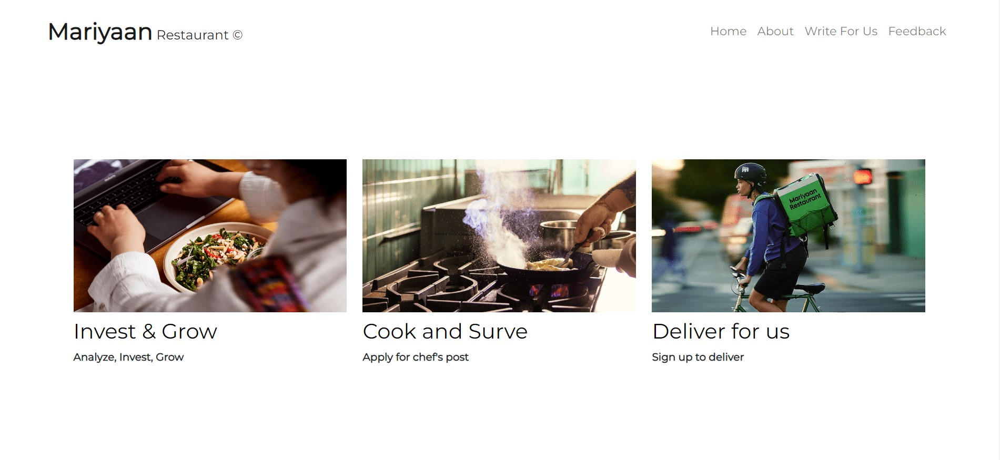
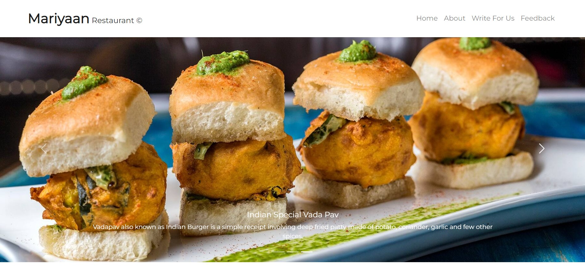
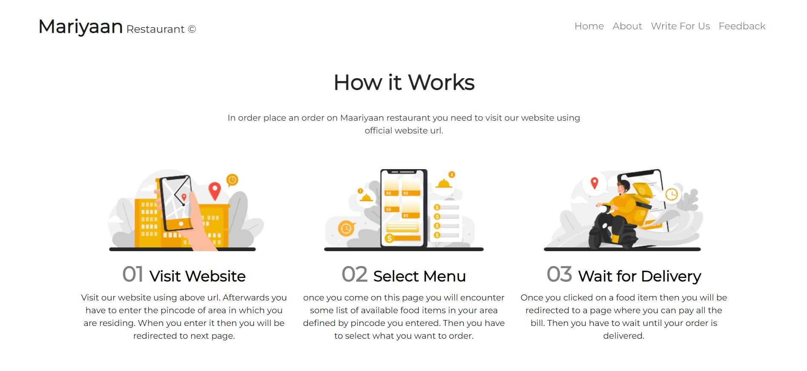
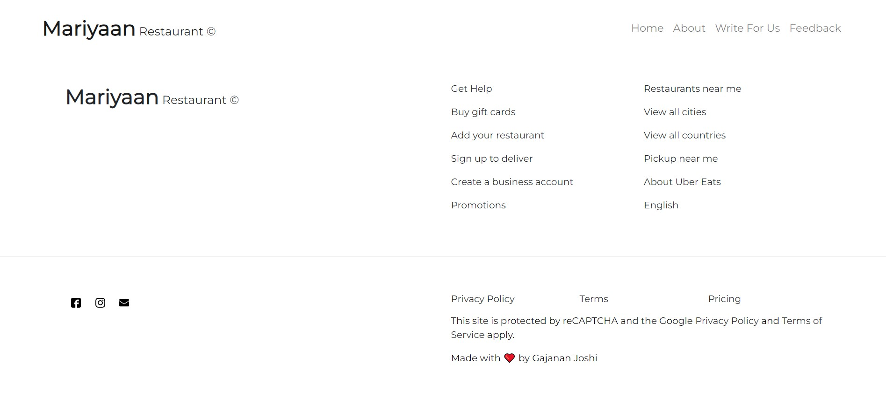

<h1>Mariyaan Restaurant</h1>

Welcome to the Mariyaan Restaurant project! This repository contains the code for the official website of Mariyaan Restaurant, featuring our menu, services, and contact information.

<h2 id="features">Features</h2>
<ul>
    <li>Responsive design for optimal viewing on different devices</li>
    <li>Detailed menu with descriptions and prices</li>
    <li>Online reservation system</li>
    <li>Feedback form for inquiries</li>
    <li>Interactive map for location</li>
</ul>

<h2 id="installation">Installation</h2>

1. Clone the repository using the following command : 

<pre><code>git clone https://github.com/GajananJoshi0601/spotify-clone.git</code></pre>

2. Open and Extract It.

3. Now run live server.

4 .Open index.html file in browser.

5. Now just right click and open with live server

6. Enjoy the images with high quality resolution.

<h2 id="overview">Quick Overview of the UI</h2>

Here are some screenshots showcasing the main features of our Spotify Clone:

    
     
    <em>Home Page</em>

    
     
    <em>Cards Page</em>

    
     
    <em>Special Indian Dishes</em>

    
     
    <em>How It Works</em>

    
     
    <em>Footer Page</em>

<h2 id="usage">Usage</h2>

You can customize the content of the website by editing the HTML, CSS, and JavaScript files in the project. Here are the main files to consider:

<ul>
    <li><code>index.html</code> - The main HTML file containing the structure of the website</li>
    <li><code>style.css</code> - The CSS file for styling the website</li>
    <li><code>script.js</code> - The JavaScript file for interactive elements</li>
</ul>

<h2>Contributing</h2>

Contributions are welcome! Please feel free to submit a Pull Request or open an issue for any bugs or feature requests.

<h2>License</h2>

This project is licensed under the Project Owner : Gajanan Joshi

<h2>Contact</h2>

If you have any questions or feedback, please feel free to reach out at <a href="mailto:gajananjoshi0601@gmail.com">gajananjoshi0601@gmail.com</a>.

<h2>Acknowledgements</h2>
<ul>
    <li>Thanks to all our contributors for their hard work!</li>
    <li>Special thanks to the open source community for providing valuable resources and tools.</li>
</ul>
